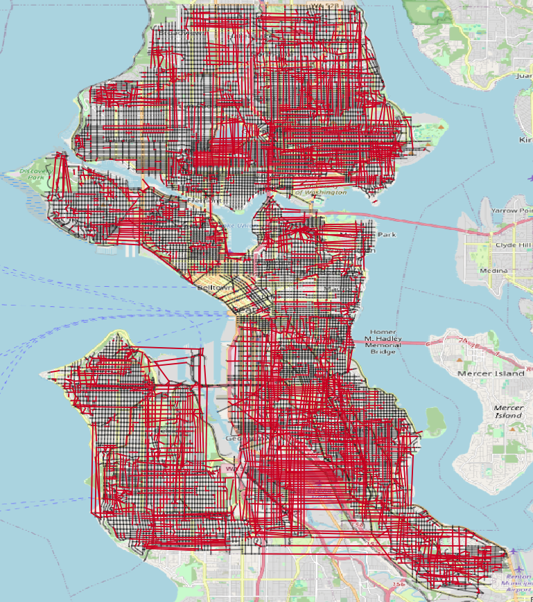

# Seattle's Disconnected Street Network
I just published to my [github](https://github.com/mike-babb/seattle_streets) page a project on identifying Seattle's disconnected street network. Briefly, streets in Seattle start, stop, and resume. A street will run for a few blocks, stop, and then resume with the same name. While I know this happens throughout the city, I was curious if it was common or not. After working on this off and on for the past six months, I was able to create this map:  
  
The red lines are the missing connections between streets and the black lines are the existing streets with discontinuities. This map was a lot of fun to make and it was incredible to see represented visually what I long sensed about navigating the city: the streets are disconnected, a little chaotic, and getting around this city can be challenging. Several facts about these added streets:

* 2,497 roads in the study area | 1,933 road miles
* 1,357 roads without discontinuities | 421 road miles  
* 1,140 roads with discontinuities | 1,512 road miles  
* 3,643 segments added across 1,140 roads | 834 miles   

I'll encourage those interested to take look at the project's [README.md](https://github.com/mike-babb/seattle_streets/blob/main/README.md) for more detailed information or this  [slide deck](https://github.com/mike-babb/seattle_streets/blob/main/seattles_disconnected_streets_2024_11_20.pptx). The code and the data used to identify the disconnected streets is available for those curious. The two python libraries I used to identify the disconnected streets are [GeoPandas](https://geopandas.org/en/stable/getting_started/introduction.html) and [NetworkX](https://networkx.org/). 