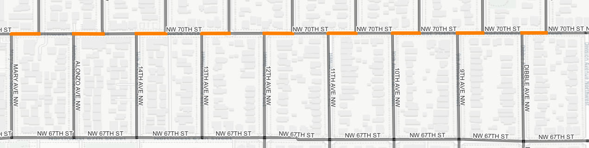
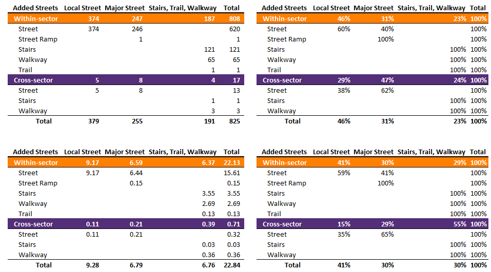
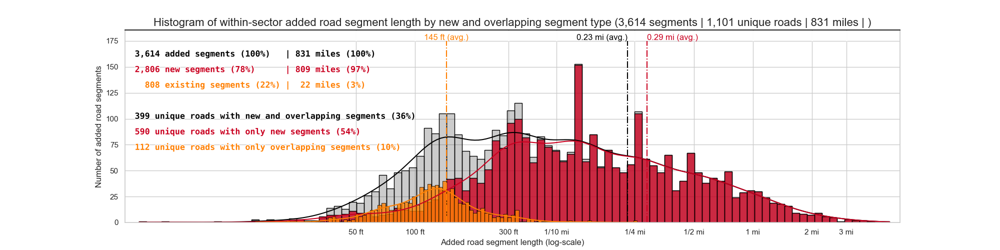

# So you've identified a bunch of (mostly) missing street connections...
A little over 4K! Great. But, do any of those added connections overlap with existing street segments? Yes! In fact, 825 segments are overlapping with existing segments. 
[SEE THIS PAGE FOR AN INTERACTIVE MAP OF V3 OF THE ADDED STREETS](/media/discontinuous_streets/discontinuous_streets_v3.html)  

The major change with this version is the identification of added, overlapping segments by within-sector (orange) and cross-sector (purple).

# Further classifying types of added segments
In version 2.0 of this project, I completed the street network by classifying and adding the following street segments.

|       Segment status |  Count | Miles |
|---------------------:|-------:|------:|
|           continuous |  3,825 |   313 |
|        discontinuous | 21,931 | 1,578 |
| within-sector, added |  3,614 |   831 |
|  cross-sector, added |    410 |   824 |

The continuous and discontinuous street segments are the existing segments in the street network. In this version of the project - version 3.0 - I was able to identify 808 within-sector, added-overlapping segments and 17 cross-sector, added-overlapping segments. The table below features the counts and percentages of the added segment status.  

|                        Segment status | Count | Percent | Miles |
|--------------------------------------:|------:|--------:|------:|
|        within-sector, added, combined | 3,614 |    100% | 3,614 |
| within-sector, added, not overlapping | 2,806 |     78% |   809 |
|     within-sector, added, overlapping |   808 |     22% |    22 |
|         cross-sector, added, combined |   410 |    100% |   824 |
|  cross-sector, added, not overlapping |   393 |     96% |   823 |
|      cross-sector, added, overlapping |    17 |      4% |     1 |

These overlapping segments are coincident with existing street segments. Mostly, the overlapping street segments are portions of the road network that are created from misaligned network grids. The graphic below demonstrates this phenomenon.  
  

In this graphic, NW 70TH ST runs west-to-east. Streets such as Alonzo AVE NW, 14TH AVE NW, and 13TH AVE NW run north south. Each of these three streets - and other north-south streets in this graphic - are not continuous. They are cut by NW 70TH ST. In other words, when traveling north on Alonzo AVE NW, a person will travel briefly on NW 70TH ST. In fact, the average length of the orange segments in the graphic above is approximately 113 feet. Further explaining the overlaps in connectivity is obtained by consulting the metadata (*always* consult the metadata) associated with the City of Seattle's Street Network Dataset. The metadata are available in a simple [html page](https://services.arcgis.com/ZOyb2t4B0UYuYNYH/arcgis/rest/services/Street_Network_Database_SND/FeatureServer/0) or [json format](https://services.arcgis.com/ZOyb2t4B0UYuYNYH/arcgis/rest/services/Street_Network_Database_SND/FeatureServer/0?f=pjson). The two variables of interest are `snd_feacode` and `segment_type`. Both of these variables describe the street segment. The table below enumerates the feature codes and segment types.

|      snd_feacode | Description         |      snd_feacode | Description            |      snd_feacode | Description     |
|-----------------:|---------------------|-----------------:|------------------------|-----------------:|-----------------|
|                1 | Local Street        |                5 | Major Street           |                9 | State highway   |
|               13 | Interstate highway  |               77 | Stairs, Trail, Walkway |               85 | Railroad        |
| **segment_type** | **Description**     | **segment_type** | **Description**        | **segment_type** | **Description** |
|                1 | Street              |                2 | Street Ramp            |                3 | Limited Access  |
|                4 | Limited Access Ramp |                5 | Alley                  |                6 | Stairs          |
|                7 | Walkway             |                8 | Trail                  |                9 | Railroad        |
|               10 | Dock                |               11 | Light Rail             |               12 | Monorail        |
|               13 | Trolley             |               14 | Parking Access         |               15 | Stub            |

Cross-tabulating the `snd_feacode` and the `segment_type` values for the overlapping streets creates counts of segments and lengths of the added segments in the tables below.  
  

Beginning with the two tables on the top we have the counts of added-overlapping segments. For the 808 within-sector added segments overlapping with existing segments - those with the header marked in orange - 374 are classified as a "Local Street" and 247 are classified as a "Major Street". Together, these account for approximately 77-percent of the added-overlapping segments. The final 23-percent of the added-overlapping segments are some combination of stairs, trail, or walkway. This makes sense because in [step 02](https://github.com/mike-babb/seattle_streets/blob/main/code/step_02_export_nodes_seattle_streets.ipynb) of the process I manually removed these types of segments as I wanted to focus on roads navigable by car. While there are only 17 cross-sector added-overlapping segments (those with the purple header), I have included those for the sake of being complete. The two tables on the bottom showcase the total number of added-but-overlapping miles. There were approximately 22 miles of within-sector added-overlapping segments and slightly less than 3/4 of a mile of cross-sector added-overlapping segments. A bit less than 16 of those within-sector added miles are overlaps with the existing street network (e.g. traversing Alonzo AVE NW requires a brief traversal on NW 70TH ST). With a nod to Seattle's walkability, complete street network connectivity is achieved by including 6.5 miles of trails, stairs, and walkways in with roads. I like that.

We gain a further a sense of the distribution of the added-but-overlapping within-sector segments by examining several overlapping histograms.
  
The red histogram `(n = 2,806)` is the distribution of the revised added, non-overlapping segments and the orange histogram `(n = 808)` is the added-but-overlapping distribution. The grey distribution `(n=3,614)` is the combination of the non-overlapping segments and the overlapping segments. This is the distribution from version 2.0 of this project. Completing connectivity involved adding 831 road miles across 1,101 unique roads. Of these roads roads, 399 featured both non-overlapping and overlapping segments, 590 featured only non-overlapping segments, and 112 featured only overlapping segments. The average added overlapping segment is 145 feet and the average added non-overlapping segment is a little more than a quarter of a mile. Splitting the added-overlapping segments into a distinct category increased the mean of the added-non-overlapping segments. Intuitively this makes sense as those overlapping segments are short jogs on existing roads while the longer non-overlapping segments are the connecting roads separated by parks, large arterials, large plots of land, and Seattle's topography. I created the above plot for the within-sector added streets due to having enough (and interesting) data to make a visualization. However, for the cross-sector added streets, a total of 17, the difference is minimal. The average cross-sector added-overlapping segment is 220 feet and the longest is a little over a quarter of a mile. 

# The technique 
When I completed Version 2.0 of this project in February of this year I was wondering how I could identify the overlapping segments. I first thought about implementing a geospatial solution using some of combination of geometry intersections and degree of overlap. But I didn't do that because I knew it would be messy, imprecise, and overly complex. As has been one of the themes of this project all along, there are suitable network analysis tools that can be used to accomplish this task. I first created a simple graph by calling [networkx.from_pandas_edge_list](https://networkx.org/documentation/stable/reference/generated/networkx.convert_matrix.from_pandas_edgelist.html). Each row in the street network data from the City of Seattle represents a road segment. Each segment has the variables `f_intr_id` and `t_intr_id` (`from intersection id` and `to intersection id`). This is the edgelist. A networkx graph has the method [has_edge()](https://networkx.org/documentation/stable/reference/classes/generated/networkx.Graph.has_edge.html#graph-has-edge) that enables rapid evaluation of the added edges. Once I knew which added segments were overlapping, I then did a little tabular analysis to figure which overlapping added segment corresponded to which existing segment. In a few cases, I found that there were multiple overlapping edges to pick from so I coded a control flow accordingly. In total it takes about one second to flag and identify the overlapped segments. The code to identify the overlapping segments and produce the graphics can be found in [step_13](https://github.com/mike-babb/seattle_streets/blob/main/code/step_13_find_overlapping_segments.ipynb).

## Facts about the added streets:
* 2,455 uniquely named roads in the study area | 1,890 road miles: see these graphics for a comparison of [miles](https://github.com/mike-babb/seattle_streets/blob/main/graphics/barplot_miles.png) and [road segments](https://github.com/mike-babb/seattle_streets/blob/main/graphics/barplot_segment_count.png)  
* 1,150 roads without discontinuities | 313 road miles  
* 1,305 roads with discontinuities | 1,578 road miles  
* 3,614 within-sector segments added across 1,101 roads | 831 miles  
  * 2,806 new segments across 989 roads | 809 miles
  * 808 segments overlapping with 511 roads | 22 miles
* 410 cross-sector segments added across 313 roads | 824 miles
  * 393 new segments across 304 roads | 823 miles
  * 17 segments overlapping with 17 roads | 1 mile
* Average of ~3.3 within-sector segments added per uniquely named road  
  * ~2.8 non-overlapping segments added per uniquely named road  
  * ~1.6 overlapping segments added per uniquely named road  
* Average of ~1.3 cross-sector segments added per uniquely named road  
  * ~1.3 non-overlapping segments added per uniquely named road  
  * ~1.0 overlapping segment per uniquely named road
* Average added within-sector segment length: ~0.23 Miles  
  * ~0.29 miles, average non-overlapping segment length
  * ~145 feet, average overlapping segment length
* Average added cross-sector segment length: ~2.0 Miles  
  * ~2.1 miles, average non-overlapping segment length
  * 220 feet, average overlapping segment length
* Median added within-segment length: ~448 Feet  
  * 678 feet, median non-overlapping segment length
  * 124 feet, median overlapping segment length
* Median added cross-segment length: ~1.1 Miles  
  * ~1.2 miles, median non-overlapping segment length
  * 137 feet, median overlapping segment length
* Greatest number of within-sector segments added: [1ST AVE NW (15 total, 10 new and 5 overlapping)](https://github.com/mike-babb/seattle_streets/blob/main/graphics/ex_23_most_added_segments_v3.png)  
* Longest within-sector segment: ~5 Miles:  [7TH PL S (10 longest added segments)](https://github.com/mike-babb/seattle_streets/blob/main/graphics/ex_24_longest_added_segments_v3.png)  
* Shortest within-sector segment: ~4 Feet: [SW CLOVERDALE ST ](https://github.com/mike-babb/seattle_streets/blob/main/graphics/ex_06_shortest_segment.png)  

 
# Future Work
As of this writing, I have no plans for future work on this project and I'm ready to move on to a new analysis. That being said, I'm sure in 6-8 months I'll come up with something new. 

